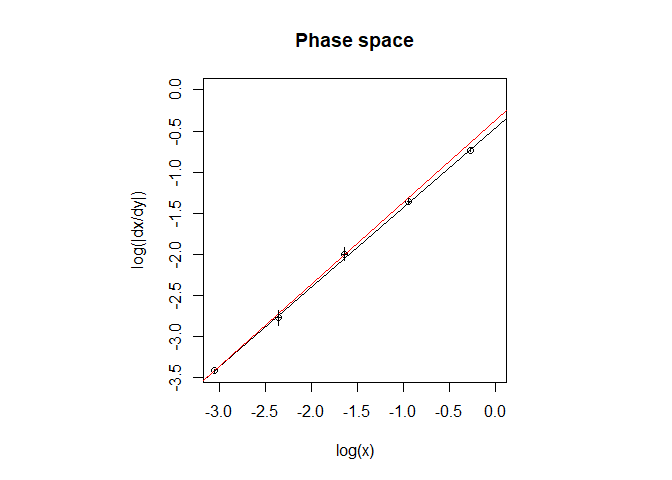
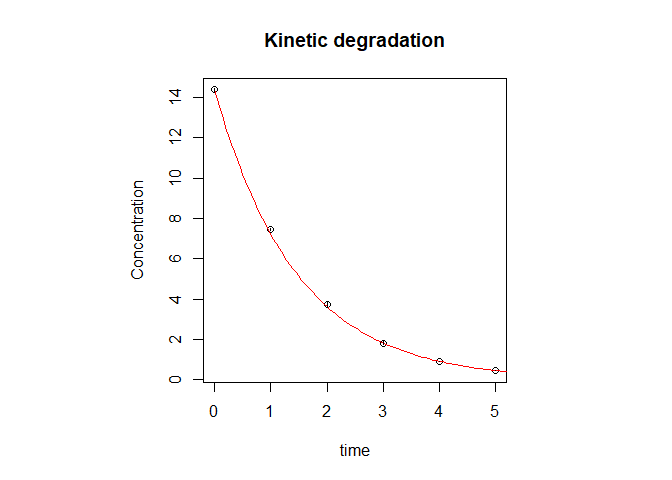

<!-- README.md is generated from README.Rmd. Please edit that file -->

# chemdeg

<!-- badges: start -->
<!-- badges: end -->

chemdeg is a package developed to assist food chemists in the objective
selection of degradation kinetic models of foods and parameters
estimation. The software implements a two-step method to this purpose.
First, experimental data are analyzed in the so-called phase space which
allows for the estimation of the order of the reaction; then the data
are fitted with the appropriate standard kinetic model to estimate the
reaction rate. The whole procedure is driven by rigorous statistical
analyses of the results. The package also provides a routine to fit a
non-standard kinetic degradation model named first-order multi-target
model (FOMT).

## Installation

You can install the development version of chemdeg like so:

``` r
# from CRAN
install.packages("chemdeg")

# from GitHub
<<<<<<< HEAD
library(devtools)
devtools::install_github("migliomatte/chemdeg,
                          dependencies = TRUE, build_vignettes = TRUE")
=======
devtools::install_github("migliomatte/chemdeg",dependencies = TRUE, build_vignettes = TRUE)
>>>>>>> 2f6a524370c8ca01a19c5ed9f9ce2ed8d6696eb5
```

## Usage

``` r
library(chemdeg)
```

#### Determination of the reaction order

The determination of the reaction order of a generic degradation kinetic
model is often prone to subjectivity. By analyzing the phase space of
the kinetic system it is possible to statistically determine the
reaction order. This information can then be used to determine the
reaction rate constant. In the package `chemdeg` the whole analysis can
be performed with the function `det_order()`:

``` r
res <- det_order(ord1)
#> Reaction order estimated: 1
```

where `ord1` is a built in function for 1<sup>st</sup>-order kinetic
model data.

The function `results` returns statistics and parameters estimates:

``` r
results(res)
#> 
#> Linear regression in the phase space: 
#> log(dx/dt)= 0.97 log(x) + ( -0.46 )
#> 
#> Estimate of n:
#> 
#>     Estimate   Std. Error      t value     Pr(>|t|) 
#> 9.701806e-01 4.235714e-03 2.290477e+02 1.835114e-07 
#> 
#> Confidence interval of n: 
#>     2.5 %    97.5 % 
#> 0.9567007 0.9836605 
#> 
#> Statistical analysis indicates that an order 1 degradation kineitc model is likely to describe the data.
#> The null hypothesis H0:
#> "The process is described by an order 1kinetic model"
#>  cannot be rejected.
#> 
#> Non-linear least squares regression was performed with an order  1  kinetic model:
#>  
#>  Estimate of k: 
#>    Estimate  Std. Error  t value     Pr(>|t|)
#> k 0.6878765 0.002626997 261.8489 1.541636e-11
#> In attesa che venga eseguita la profilazione...
#> Confidence interval of k: 
#>      2.5%     97.5% 
#> 0.6812276 0.6947116 
#> 
#> Goodness-of-fit:
#>                  Value
#> AIC:        -11.933893
#> AICc:       -10.933893
#> BIC:        -12.350374
#> RMSE:         2.002812
#> Chi-sq_red:   5.379602
#> -----------------------------------------------------
```

Plots of the data in both the phase space and the normal concentration
vs time space along with their best fits with model equations can be
accessed with `plot_ord()`:

``` r
plot_ord(res)
```



#### First-order multi-target model fitting

The following is an example of first-order multi-target (FOMT) model.
The `FOMT()` function can be used to perform the fit:

``` r
fit_fomt <- FOMT(fomtdata)
summary(fit_fomt)
#> 
#> Formula: y ~ 1 - (1 - exp(-k * t))^n
#> 
#> Parameters:
#>   Estimate Std. Error t value Pr(>|t|)    
#> k 0.056836   0.008206   6.926 0.000449 ***
#> n 9.478174   3.926148   2.414 0.052280 .  
#> ---
#> Signif. codes:  0 '***' 0.001 '**' 0.01 '*' 0.05 '.' 0.1 ' ' 1
#> 
#> Residual standard error: 0.04243 on 6 degrees of freedom
#> 
#> Number of iterations to convergence: 10 
#> Achieved convergence tolerance: 3.98e-06
```

where `fomtdata` is an example data-frame provided with the package.

If the `FOMT()` function does not converge, it is possible to use the
`nls` function from `stats` package as follows (in this case a ):

``` r
fit_fomt1 <- nls(y ~ FOMTm(t, k, n),
  data = list(y = fomtdata$tCQA_AA, t = fomtdata$time_h),
  start = list(n = 10, k = 0.05)
)
summary(fit_fomt1)
#> 
#> Formula: y ~ FOMTm(t, k, n)
#> 
#> Parameters:
#>   Estimate Std. Error t value Pr(>|t|)    
#> n 9.478163   3.926141   2.414 0.052280 .  
#> k 0.056836   0.008206   6.926 0.000449 ***
#> ---
#> Signif. codes:  0 '***' 0.001 '**' 0.01 '*' 0.05 '.' 0.1 ' ' 1
#> 
#> Residual standard error: 0.04243 on 6 degrees of freedom
#> 
#> Number of iterations to convergence: 9 
#> Achieved convergence tolerance: 5.453e-06
```

#### Goodness-of-fit statistics

`chemdeg` implements the chi-squared reduced statistics
($\chi^2_{red}=\chi^2/df$ where $df$ are the degrees of freedom) and the
Akaike Information Criterion with correction for small sample size
(AICc) as goodness of fit measures. These can be accessed with the
functions `chiquad_red()`and `AICC()`, respectively.

To access the full table comprising the Bayesian Information Criterion
(BIC), Akaike Information Criterion (AIC), AICc, Root Means Squared
Error (RMSE) and $\chi^2_{red}$ (from both package `stats` and
`chemdeg`) call the function `goodness_of_fit()`:

``` r
goodness_of_fit(fit_fomt)
#>                    Value
#> AIC:        -24.15681095
#> AICc:       -21.75681095
#> BIC:        -23.91848633
#> RMSE:         0.04243006
#> Chi-sq_red:           NA
```

For more details see [chemdeg basics](articles/chemdeg_basics.html).
